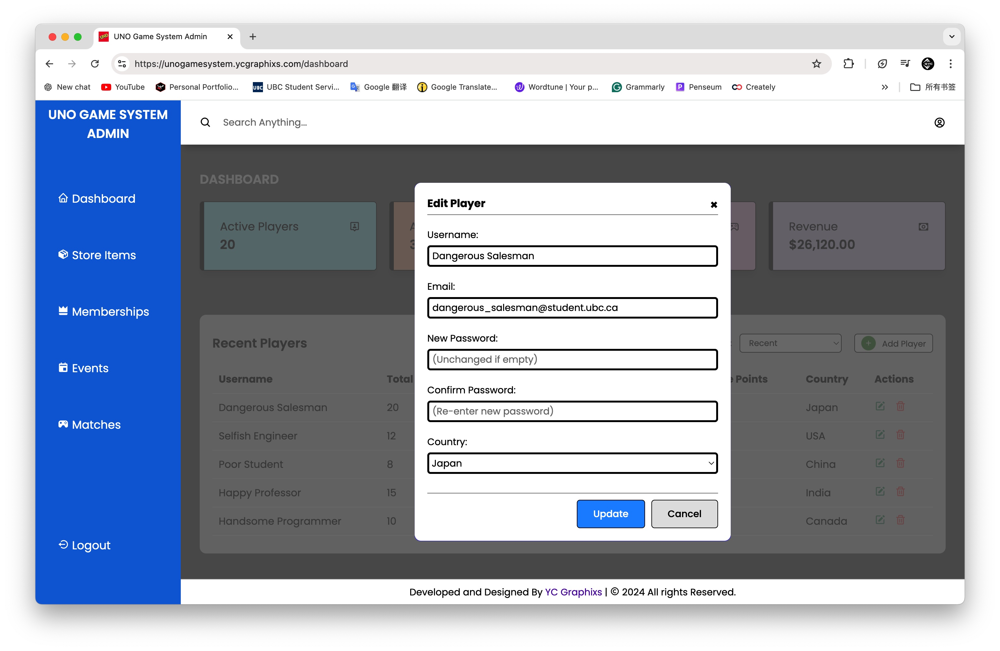
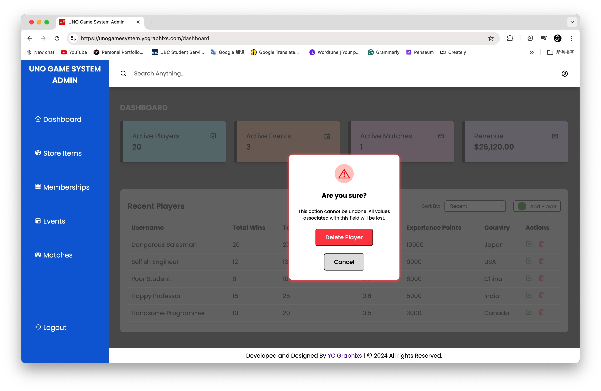
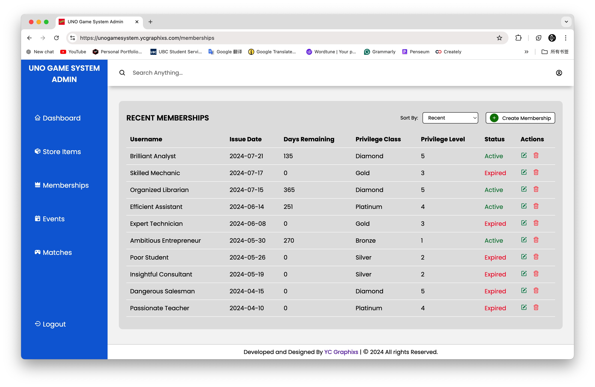
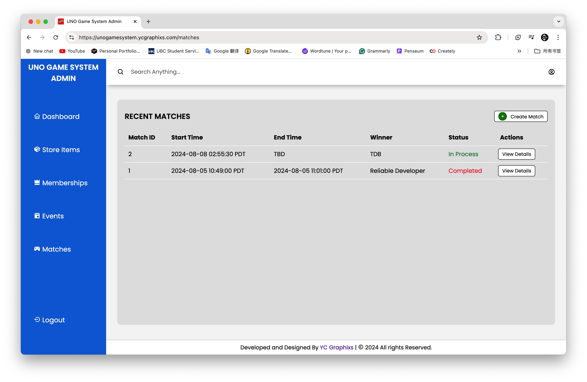
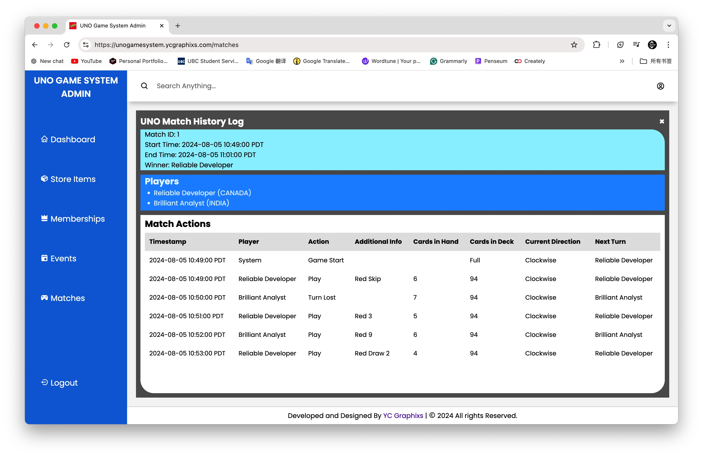

# UNO Game System


## Project Description

The UNO Game System is a comprehensive web application designed to manage and enhance the gameplay experience of the popular card game UNO. Built using Node.js with an Express server, the system incorporates various features to facilitate game administration and user interaction. It includes functionalities for user authentication, event and match management, membership handling, and store item administration. The project leverages EJS for server-side rendering and integrates MySQL for robust data management. With a user-friendly interface styled through CSS and interactive elements handled by JavaScript, the system ensures smooth navigation and efficient management of game-related activities. Moreover, this project uses modern development tools such as dotenv for environment variable management and bcryptjs for secure password handling, further strengthening the system's reliability and security. Overall, this UNO Game System aims to provide a seamless and engaging platform for both players and administrators, enhancing the UNO gaming experience.

### Login Details:
- Here are the login details. I trust you to use them with respect and responsibility. Please do not misuse this access or fool around. 
```
Username = admin
Password = admin123
```

### ER Diagram:


<br>

## Dashboard UI





## Store-Items UI


## Memberships UI


## Events UI


## Matches UI




